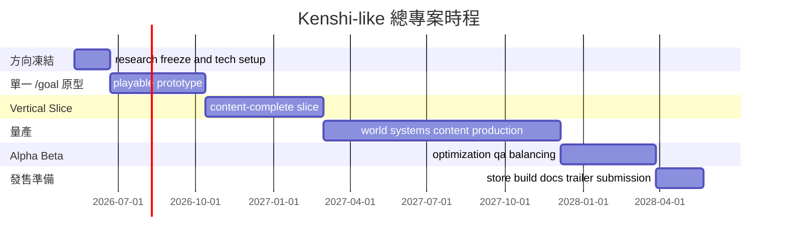
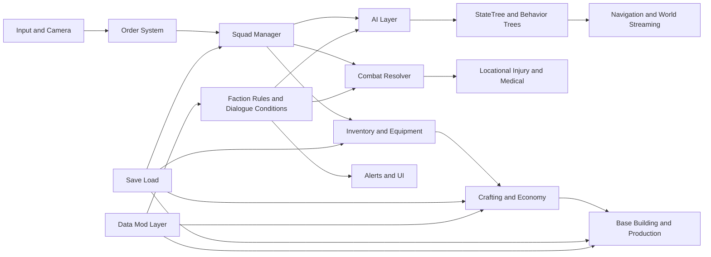

# Kenshi 2 深度研究與 Codex 單一目標開發藍圖

## 執行摘要

截至 **2026 年 5 月 6 日**，官方對 Kenshi 2 的公開資訊其實不算多，但方向已經很清楚：它是設定在 **一千年前 Old Empire 時代** 的前傳；開發路線先從原本打算延續 OGRE 的方案，轉向 UE4，之後又在 2024 年明確確認已轉到 **UE5**；官方仍未給出發售窗口，只維持「做好才發」的口徑；而且 2024 年時團隊規模已到 **33 人**，並表示手上已有**可玩的版本**。公開訊號集中在：更大的世界模擬、更完整的社會與派系設計、對模組友善的 FCS 演化、城鎮 district 分區工具、差異化 Hiver 模型、可擴充的資源系統，以及更反應式的對話／敘事條件。citeturn6view2turn6view1turn13view0turn6view3turn13view1turn33view1

因此，如果你的真正目標不是做一個逐項照抄的粉絲重製，而是做出一款**以 Kenshi 2 為設計標竿的 3D 可玩沙盒 RPG**，最穩妥的技術答案其實很直接：**Windows 單機優先、UE5 為首選引擎、單一 /goal 驅動、原型先做 16 週，再往 vertical slice 與量產延伸。** 這條路不只是因為官方自己也走 UE5，還因為 UE5 在大世界流送、幾何細節、動態光照、物理、Mass 實體、StateTree、GAS 與 PCG 上，已經把你最需要的東西放進同一套工具鏈。citeturn13view0turn15search0turn15search5turn15search6turn14search1turn21search6turn22search4turn22search7

若以英國／歐洲中型獨立團隊的薪資帶回推，這種規模的 fully-loaded 開發成本大致會落在 **£3.8M–£7.5M**，未含發行行銷、平台分潤與額外授權；如果只做一個能打、能跑、能建、能招募、能存檔的 **UE5 playable prototype**，合理區間約 **£0.35M–£0.75M**。這不是官方成本，而是依 2025 年英國遊戲職務薪資帶、Bristol 資深工程師總薪區間，再結合本報告的人力配置模型做的推估。citeturn30search1turn30search6

你前面補的需求我完全同意：**不要拆成一堆人類手動管理的小計畫**。下面這份規劃會收斂成一個可以直接貼進 Codex 的**單一 /goal 任務**，讓代理在同一個目標裡自己跑建置、驗證與測試。這也符合 entity["organization","OpenAI","ai company"] 官方 Codex 文件的最佳實務：先寫清楚 Goal、Context、Constraints、Done when，再把驗證條件直接放進任務裡。citeturn36search1turn36search8turn36search12turn36search15

## 來源盤點與確認邊界

Kenshi 2 的官方溝通策略很有自己的脾氣：entity["company","Lo-Fi Games","bristol uk studio"] 明說不想為了曝光提前爆雷，所以公開材料多半是**技術、流程、工具與少量視覺 tease**，而不是完整設定集。換句話說，做研究時最怕的不是資料少，而是把社群幻想、論壇願望清單與官方已確認內容混在一起。這份報告因此會把 **「官方已確認」** 與 **「可執行推導」** 明確分層。citeturn13view0turn6view5

| 類型 | 來源 | 可採信重點 | 用途 |
|---|---|---|---|
| 官方世界觀起點 | Lo-Fi 論壇公告 | Kenshi 2 為前傳，時間在一千年前 Old Empire 時代；2019 當時原本仍打算走 OGRE 升級線。 citeturn6view2 | 確認時代、敘事基底 |
| 官方技術里程碑 | Lo-Fi 開發網誌 | 2019 宣布改用 UE4；2024 再確認已轉 UE5、33 人團隊、可玩版本、GUI 與資產流程重構。 citeturn6view1turn13view0 | 技術選型與排程基準 |
| 官方功能 tease | Lo-Fi Community Updates | 公開過 district divider、FCS 更新、第一個大型派系、River Raptor、Hiver 子種模型等訊號。 citeturn6view3turn33view1turn13view1 | 拆解系統優先級 |
| 官方中文材料 | Lo-Fi 中文站 | 已有中文化流程、Hiver 設計與 2024 UE5/Q&A 中文頁；這些是中文的一手材料，不只是轉載。 citeturn12search0turn12search3turn13view1 | 符合中文研究優先 |
| 平台與商店資料 | entity["company","Steam","pc game platform"] 商店與新聞 | Kenshi 本體標為單人，支援 Workshop 與關卡編輯器；目前檢索到的 Kenshi 2 公開資訊，仍主要掛在 Kenshi 商店新聞與官網，**未見獨立 Kenshi 2 Steam 商店頁**。 citeturn7view1turn31search0turn31search1 | 平台範圍、單機優先、模組線索 |
| 主要媒體旁證 | entity["organization","PC Gamer","games media"] | 2025 年報導再次強化 Kenshi 的核心精神：脆弱、失敗、挫折與非英雄式求生。 citeturn6view8 | 設計哲學旁證 |
| 華語媒體與社群索引 | entity["organization","巴哈姆特","taiwan gaming media"]、entity["organization","香港01","hong kong media"] | 中文圈資訊多半圍繞一代中文化、世界規模與官方宣告摘要；能補語境，但官方中文頁的可信度更高。 citeturn32search7turn6view10turn11search10turn11search17 | 中文語境補強 |

研究邊界一句話總結：**世界時代、引擎、團隊規模、工具方向已經很清楚；完整派系名單、最終地圖範圍、核心系統最終規格與發售日期仍未公開。** 也因此，下面的設計拆解不會假裝知道官方還沒講的東西，而是會用「已確認訊號」去反推出一份真的能做的規格。citeturn13view0turn33view1turn6view2

## 遊戲設計拆解

如果把官方材料翻成開發語言，Kenshi 2 不是「把 Kenshi 1 換漂亮皮」，而是「用更好的世界／內容工具，把 **挫敗、生存、群體互動、城鎮政治與基地經濟** 做得更深」。一代 Steam 商店與歷年官方部落格，已經把這個系列最重要的骨架講得非常白；二代公開的工具、美術與敘事更新，則告訴你哪些骨架正在被升級。citeturn7view1turn7view0turn7view2turn13view0turn33view1

| 面向 | 官方已確認或高可信基底 | 對新作的可執行規格 |
|---|---|---|
| 核心機制 | Kenshi 的明牌是**單機、小隊、開放世界、非線性沙盒**；玩家可以當商人、小偷、叛軍、軍閥、農夫、奴隸等，不靠主線而靠世界互動自造故事。citeturn7view1turn12search6 | 你的規格應該維持三層 loop：**生存**（受傷、飢餓、資源）、**小隊**（招募、角色分工、搬運傷兵）、**據點**（研究、生產、防禦、交易）。不要先做傳統任務導向 RPG，再硬貼「沙盒」貼紙。 |
| 世界觀與 lore | 官方確認 Kenshi 2 發生在一千年前的 Old Empire；2025 官方影片也再次強調，這會讓玩家直接經歷前史而不是只撿遺跡碎片。官方 2024 Q&A 說世界與社會在二代比一代更 fleshed out。citeturn6view2turn6view5turn13view0 | 建議把世界內容設計成「**同地貌，不同文明密度與政治結構**」：你不是做末世拾荒，而是做一個**正在走向崩壞前夜**的殘酷文明。這樣既吃到 Old Empire 前傳優勢，又能避開直接重述一代地點。 |
| 派系與城市社會 | 官方尚未公開完整派系列表，但已提到 writers 正在做「**第一個大型派系**」，同時也強調做出了更完整的**獨特社會**；district divider 可按**財富、派系、種族**切城市分區。citeturn33view1turn13view0turn6view3 | 產品規格建議至少做 **三個宏觀派系** 與 **兩層城市分區**：外圈工業／貧民區，內圈政權／商業區。這樣一個城鎮就能同時承載治安、階級、稅收、巡邏與敵對反應。 |
| 種族與視覺辨識 | 2021 Hiver 更新明講：一代多個 Hive 亞種共用模型，二代會讓**每個 Hiver 子種都有自己的模型**；這是官方明確在做的辨識度升級。citeturn13view1turn13view0 | 角色設計不能只靠配色區分。請把**骨架比例、肢體語言、頭部 silhouette、裝備掛點與動畫節奏**都拉開，讓玩家在遠景就能判斷「誰是工兵、誰是兵種、誰是貴族／祭司」。 |
| NPC / AI 系統 | 官方一代 Steam 文案已明示「智能 AI、長期目標、搬運傷兵、可代跑生產」，更早的 Guard AI 部落格也說過守衛需要判斷**行為與意圖**，不能只看當下動作；district 系統與嵌套式對話條件又讓反應更細。citeturn7view0turn7view2turn6view3turn13view0 | AI 架構不該只做 BT。建議採 **StateTree/BT + Utility Scoring + Event Memory**：StateTree 管高階狀態，BT 管局部行為，Utility 決定短期優先級，Memory 記錄仇恨、通緝、救援與見證事件。這樣才能做出「看見你偷東西」、「你幫我打架」、「你是最近搶商隊的人」這種 Kenshi 風味。 |
| 角色成長與 progression | Steam 頁明示 Kenshi 沒有等級分配，也**不會隨玩家等級縮放世界**；角色成長靠行為練成，小隊越用越強，而且外表也會變。citeturn7view1 | 新作應維持 **use-to-improve** 而不是傳統 XP level up。具體做法是：戰鬥、跑商、搬運、醫療、鍛造、偷竊、指揮，各自擁有可練技能與關聯被動；並將傷痕、義肢、疲勞與裝備負重納入戰力模型。 |
| 戰鬥與受傷 | 官方 Steam 明示有**擬真醫療系統、部位傷害、斷肢、失血、義肢替換、扛傷兵撤退**。這是系列最核心的 mechanical identity。citeturn7view0 | 你的原型一定要把「打輸也有故事」做出來。最低要求是：部位獨立 HP、流血／昏迷、搬運、臨時包紮、永久義肢槽位。沒有這套，作品只會變成一般即時戰鬥沙盒。 |
| 製作、基地、經濟 | Steam 頁列得很完整：研究新裝備、鍛造新 gear、建基地、升級防禦、買與升級房屋、開店做生意；2024 Q&A 又說資源系統已模組化，讓 modder 能新增黃金礦之類的新資源類型。citeturn7view1turn13view0 | 經濟規格建議做成 **資源節點 → 生產鏈 → 庫存 → 價格／危險度**。最少要有鐵、布、食物、醫藥、建材五條鏈；價格不是固定表，而是依區域供需、派系關係與治安風險浮動。 |
| UI 與控制 | 官方一代本質是 RTS-RPG 混種；Lo-Fi 團隊頁也清楚列出有專做 UI programming 的程式。二代 2024 Q&A 又明講這次是重做 GUI 與內容管線。citeturn7view1turn6view7turn13view0 | UI 不能做成一本道 action HUD。你需要的是**隊列面板、快速切角、拖曳多選、命令狀態、傷情可視、製作／研究排程、派系關係、通緝／仇恨通知**。說白一點，這是一套輕 RTS 的可讀性問題。 |
| 音訊與藝術風格 | 一代官方自述世界是 **sword-punk**、荒漠、無魔法；2020–2024 公開內容又補上更完整的時間系統、雲層、PBR 材質與從零重做的角色／建築資產。官方對 Kenshi 2 音訊細節談得少，但在地化文章明確強調文字與氛圍要一起服務玩家感受。citeturn7view1turn33view0turn13view0turn6view4 | 美術應走 **乾、舊、硬、風沙、金屬、鹽蝕、骨感**，但因為是前傳，建議比一代多一點「尚未徹底崩塌的文明秩序」。音訊則應偏稀疏、環境主導、低頻工業噪、遠距戰鬥與風聲層疊，而不是滿地 BGM 鋪滿。這裡的音訊細節屬推導，不是官方已公布最終規格。 |
| 模組支援與在地化 | 官方 2019 就說 mod support 仍是高優先；2021 明講所有功能都帶著 FCS 在想，知識門檻會與一代相近；部分建築將改到 Unreal Blueprint 製作；2021 在地化文章又說翻譯從開發中期就一起跑，FCS 內有翻譯註記。citeturn6view1turn33view1turn6view4turn13view0 | 如果你打算做可持續產品，請從第一天就資料驅動：**DataTable／JSON schema／外部文本鍵值／可熱重載物件定義**。原型期先做「可外掛內容」，之後再做「作者工具」。不要反過來。 |

補一句現實校正：**官方目前沒有公開完整派系列表、完整地圖、完整 UI、完整音訊設計。** 所以上表右欄不是「官方設定整理」，而是「依官方釋出的系統方向，反推一份足夠像 Kenshi、又真的能落地的產品規格」。citeturn13view0turn33view1

## 技術架構與團隊配置

技術選型不用裝神祕。若你的目標是做出一款 **Kenshi-like、3D、可擴充、可量產** 的沙盒 RPG，**UE5 是首選，Unity 6 / DOTS 是備選，Godot 4 只適合極度成本敏感且願意自己補一大段工具鏈的團隊**。原因不是品牌信仰，而是工時。Lo-Fi 自己已經在 Kenshi 2 上走到 UE5，還明講他們為此重做 GUI、資產與系統管線；同時，entity["company","Epic Games","engine company"] 官方文件把 World Partition、Nanite、Lumen、Chaos、Mass、StateTree、GAS、PCG 幾乎都給齊了。對這種大地圖、多單位、AI 密集、基地與經濟交織的單機遊戲，原生整合就是比較省命。citeturn13view0turn15search0turn15search5turn15search6turn14search1turn21search6turn22search4turn22search7

| 引擎 | 適配度 | 為什麼適合或不適合 | 結論 | 依據 |
|---|---|---|---|---|
| UE5 | 很高 | 與 Kenshi 2 官方路線一致；World Partition 適合大世界流送；Nanite/Lumen/Chaos/Mass/StateTree/GAS/PCG 都有官方支援。 | **首選** | citeturn13view0turn15search0turn15search5turn15search6turn14search1turn21search6turn22search4turn22search7 |
| Unity 6 / DOTS | 中 | Entities、Physics、Addressables、Netcode 能撐大型模擬，但很多大世界與 AI 工作流要自行拼裝；優勢在跨平台與 C# 生產力。 | 備選 | citeturn25search7turn25search6turn24view1turn24view5turn27search6 |
| Godot 4 | 低到中 | MIT 授權很自由，但官方主機 middleware 與大型商業 3D 工作流仍較保守，很多事情要自己補。 | 只適合極小團隊或研究案 | citeturn14search3turn26search1turn26search15turn17search14 |

在 networking 上，我的建議很乾脆：**先不要做多人。** Kenshi 官方商店本來就是單人；公開的 Kenshi 2 內容也全部圍繞世界模擬、內容工具、AI、資產與敘事，而不是同步架構。再加上 Epic 的官方知識庫本身就指出，World Partition 上方目前對 listen servers 沒有官方支援，等於這案子的 co-op 會同時撞上世界流送、導航、建築同步與受傷／存檔一致性的四面牆。若未來真要做 co-op，請把它當成 alpha 後的獨立 R&D 分支，不要當首發範圍。citeturn7view1turn13view0turn6view3turn33view1turn15search28

效能目標也不要寫成「畫面超猛」，要寫成**可驗收的 frame budget**。Epic 的 Lumen 文件明講其可擴展性設計是圍繞 **30 與 60fps** 的目標；對這類高單位數量與長視距作品，應先把 prototype 守住 **1080p / 60fps 的可玩互動**，量產版則以 30/60fps 雙目標設計可擴展品質。換句話說，這案子的性能關鍵不是單張截圖，而是**城鎮人口、基地物件、AI 導航與遠景 streaming 疊在一起時，還能不能保持互動穩定**。citeturn34search0turn34search4turn34search17

| 中介層／工具 | 建議 | 主要用途 | 何時導入 | 依據 |
|---|---|---|---|---|
| Houdini Engine for Unreal | 建議用 | 程序化橋樑、道路、聚落 blockout、關卡輔助工具；不是 runtime，但很適合生產內容。 | vertical slice 前就導入 | citeturn23view11turn23view12 |
| SpeedTree | 建議用 | 大世界植被、風動、季節與 library 資產；可快速撐起野外生態密度。 | 美術量產期導入 | citeturn23view13 |
| Recast / Detour | 建議作為導覽核心 | 支援 tiled navmesh、重建、階層式路徑規劃與 navmesh data streaming，很貼合大地圖 NPC。 | prototype 就要鎖定 | citeturn23view14 |
| FMOD | 小到中團隊優先 | 反應式音樂、即時混音、快速試聲與 live profiling。 | prototype 可先上 | citeturn18search2turn18search11 |
| Wwise | 音訊重、團隊大時優先 | 完整 authoring + sound engine，Unreal 有正式整合流程。 | vertical slice 起導入較穩 | citeturn19search4turn20search13turn20search21 |

| 類別 | 建議資源 | 用法 | 去留策略 | 依據 |
|---|---|---|---|---|
| 專案骨架 | Lyra Starter Game | 拿來參考模組化架構、輸入、常見 gameplay 流程與 UI pattern。 | **只借骨架，不整包繼承。** | citeturn23view9 |
| 動畫骨架 | Game Animation Sample | 直接借 motion matching、第三人稱 locomotion、traversal 思路與 500+ 動畫參考。 | prototype 必用 | citeturn23view10 |
| 高品質地表／岩石 | Quixel Megascans | 快速撐起沙地、岩層、破敗材質與 PBR 地表。 | 量產期可保留一部分 | citeturn28search1turn28search7 |
| 灰盒與 blockout | Kenney 免費資產 | 初期城鎮、基地、UI 圖示與灰盒驗證很好用。 | 後期多數替換 | citeturn28search2 |
| 角色佔位動畫 | Mixamo | 原型期快速補齊站立、跑步、攻擊、受擊 placeholder。 | 通常在 vertical slice 後汰換 | citeturn28search3 |

Lo-Fi 公開團隊結構也很值得抄作業。從官網與更新可以看到，他們不是只有幾個程式加幾個美術，而是已經明確分出 lead programmer、UI programmer、writers、environment artists、concept artist、lead artist、operations／producer 等職能。這剛好說明：像 Kenshi 這種沙盒不是靠「一位超神 gameplay coder」就能憑空長出來的，它本質上是**系統工程 + 內容工程 + 工具工程**的三明治。citeturn6view7turn13view0turn33view0

三條 senior lane 不能省。第一條是 **Gameplay / Simulation Engineer**，要懂資料導向思維、存檔一致性、非同步流送、戰鬥與受傷模型，以及 profiler。第二條是 **AI / Navigation Engineer**，要懂 navmesh streaming、StateTree / Behavior Tree、utility scoring、事件記憶與可視化 debug。第三條是 **Tools / UI Engineer**，要懂 editor tooling、content validation、build automation、mod schema 與 localization pipeline。若你能再補一位 **Technical Animator / Technical Artist**，要求就應包含 motion matching、retarget、材質／shader、程序化內容與 GPU/CPU profiling。這四條線湊齊，遊戲才不會寫到一半變成滿地 TODO 的廢土。citeturn30search1turn30search6turn13view0

| staffing 模式 | 建議人數 | 主要角色組合 | 期間 | 估算成本 |
|---|---:|---|---:|---:|
| Lean Prototype | 7–9 人 | 2 程式、1 AI／工具、1 TA／動畫、1 環境美術、1 角色／裝備、1 設計／內容、0.5–1 QA／PM | 4–5 個月 | £0.35M–£0.75M |
| Core Vertical Slice | 12–16 人 | 在原型基礎上補 UI、更多內容作者、第二位環境美術、專職 QA、音訊 | 8–10 個月 | £1.3M–£2.6M |
| Full Production | 15–22 人 | 再補更多內容、美術量產、QA、自動化與外包管理 | 24–30 個月 | £3.8M–£7.5M |

上表是**本報告推估**，不是官方數字；它的底是 2025 英國遊戲職缺薪資帶與 Bristol 資深工程師總薪區間，再加上間接成本、軟硬體、外包與 QA 緩衝去估。citeturn30search1turn30search6

## 單一 /goal 驅動的開發路線圖

官方 Codex 的最佳實務其實很像一個狠角色製作人：先把 **Goal、Context、Constraints、Done when** 寫死，先讓 Codex 產出 **PLAN.md**，再要求它在改碼前追出風險點、驗證點與狀態轉移。Codex app／cloud 又支持平行 thread、subagents、skills 與 goal metadata，所以你完全可以維持 **「一個主目標，內部並行；驗收標準只有一套」** 的工作法。這正是你要的，不用人類去切一堆小任務再手動保姆式追著跑。citeturn36search1turn36search6turn36search7turn35search3turn35search5turn35search9turn36search15

先講總專案節奏。人的長程管理可以這樣排，但交給 Codex 真正執行與自驗證的，是其中那段 **playable prototype**。下面這張 Gantt 是**同一個產品目標**的長短期節點，不是拆成多個互不相干的小計畫。



而真正可直接用來「放進 Codex、讓它自己做、自己驗、自己測」的，就是下列這份**單一 /goal 內容**。寫法刻意遵守官方建議，把目標、脈絡、限制、完成條件與驗證步驟都內嵌進去。citeturn36search1turn36search8turn36search12

```text
/goal

Goal:
在 UE5 建立一個可玩的 3D 單機小隊沙盒 RPG 原型，靈感取自 Kenshi 2 的設計方向，但所有名稱、角色、派系、美術與地點必須使用原創 placeholder 或自有 IP 命名。原型必須包含：小隊控制、招募、即時戰鬥、部位傷害、受傷搬運、城市敵我反應、簡化基地建設、基本生產鏈、買賣、存讀檔，以及最少一個可巡邏的城市與一個可建造的野外據點。

Context:
- engine: UE5 latest stable for project
- starter references: Lyra Starter Game, Game Animation Sample
- target platform: Windows PC only
- camera: third-person + tactical zoom
- world scope: 1 主城、1 小型前哨、1 野外建造區、3 派系、4 可招募成員上限
- docs to create first: PLAN.md, TECH_SPEC.md, CONTENT_SCHEMA.md, TEST_PLAN.md
- repo must contain: /Source /Content /Config /Docs /Tests /BuildScripts

Constraints:
- 不建立多個人類手動管理的小計畫；保持單一主目標。
- 如需並行，只能由 Codex 在同一 goal 內建立 subagents，最後統一回收結果。
- 每次重大修改前建立 git checkpoint。
- 系統必須資料驅動：factions, items, resources, recipes, buildings, npc schedules 由 data tables / json 控制。
- 原型所有測試可在本機與 CI 重跑。
- 先做單機，不做多人，不接 EOS，不做主機平台。
- 先用 placeholder 資產，禁止為了等待終版資產而卡住功能。

Done when:
- 玩家可控制 1–4 人小隊移動、編隊、攻擊、待命、搬運倒地隊友。
- 戰鬥具備頭/胸/腹/左臂/右臂/左腿/右腿部位傷害，失血、倒地、簡化義肢槽位。
- 城市守衛能判定偷竊、攻擊、自衛與禁區闖入，並觸發敵對、追捕或放行。
- 玩家可招募 NPC、購買物品、販賣物品、建造至少 5 種建築、跑 1 條食物與 1 條金屬生產鏈。
- 世界可存讀檔，重新載入後位置、血量、庫存、建築、派系關係與生產隊列不錯亂。
- 打包出可執行 Windows build，並附自動測試報告、效能報告與已知問題清單。

Validation:
- 每次合併前執行 unit tests、functional tests、play-in-editor tests。
- 每晚執行 30 分鐘 soak test：城市巡邏、商人進出、玩家建造、戰鬥、存讀檔循環。
- 每個 Gate 都要跑 perf capture，主城人口密度目標場景幀率不得低於 60 fps target 的 85%。
- 若測試未過，繼續修到通過，不要停在“差不多可以”。

Outputs:
- /Builds/Windows/KenshiLikeProto.exe
- /Docs/PLAN.md
- /Docs/TECH_SPEC.md
- /Docs/TEST_PLAN.md
- /Docs/ADR/*.md
- /Reports/test-results.xml
- /Reports/perf-summary.md
- /Reports/content-lint.md
```

這個主目標往下跑時，我會建議你把 16 週原型拆成**同一 /goal 內的八個 Gate**。注意，是 gate，不是八份不同計畫。每個 gate 都有明確 deliverable、明確驗收、明確風險。這樣 Codex 才知道自己不是在做「寫一些東西」，而是在做「把某個風險壓穿」。citeturn35search5turn35search9turn36search15

| Gate | 週數 | 交付物 | 自動驗證 | 最大風險與破解法 |
|---|---:|---|---|---|
| 基礎骨架 | 1–2 | Repo、UE5 專案、資料表 schema、CI、測試框架、PLAN.md | build、lint、空場景啟動、資料表 load | 一開始就把專案搞成示範專案拼裝怪；破解法是先鎖 architecture decision records |
| 移動與鏡頭 | 3–4 | 第三人稱移動、戰術縮放、選取、下指令、隊列 UI | input regression、camera bounds、path request smoke tests | 控制手感像 RTS 和 ARPG 兩邊都不像；破解法是先守「單一角色玩起來不痛苦」 |
| 世界與導航 | 5–6 | 城鎮 blockout、野外建造區、navmesh、巡邏點、spawn 管線 | navmesh bake、NPC 巡邏 15 分鐘不脫軌 | world streaming 太早 overbuild；破解法是只做一城一野區 |
| 戰鬥與傷害 | 7–8 | 近戰、受擊、部位傷害、流血、倒地、搬運、基礎醫療 | combat functional tests、injury persistence、carry/drop cycle | 變成普通打血條；破解法是部位傷害與倒地必須先落地 |
| 小隊與招募 | 9–10 | 招募、跟隨、編隊、角色面板、簡化關係值 | recruit flow tests、formation stability tests | 小隊命令彼此打架；破解法是 order ownership 與 interrupt priority 先定義 |
| 建造與經濟 | 11–12 | 地基、建築放置、庫存、採集、兩條生產鏈、商店買賣 | build placement tests、recipe chain tests、inventory consistency | 內容還沒多就先被經濟 bug 搞爛；破解法是從最小生產鏈開始 |
| AI 與派系反應 | 13–14 | 偷竊判定、禁區判定、自衛判定、守衛追捕、敵對切換 | suspicion/hostility tests、save-load faction replay | AI 全憑腳本硬寫；破解法是用 state + event memory 而不是 event spaghetti |
| 打包與回歸 | 15–16 | Windows build、測試報告、效能報告、已知問題清單、內容 lint | full regression、soak test、perf capture、packaged build launch | 臨門一腳全是 content breakage；破解法是內容 lint 與 nightly soak 從第 1 週就上 |

下面這張系統流程圖，則是我建議你在原型期就鎖定的**主要系統耦合圖**。它把官方已公開的世界分區、AI、FCS／資料驅動、資產與敘事訊號，收斂成一個真正能畫出工程邊界的骨架。citeturn6view3turn13view0turn33view1turn21search6turn14search1



最後，Codex 要跑得漂亮，不能只給它一句「做個像 Kenshi 的東西」。照官方文件，技能化（skills）與內建驗證是關鍵。所以我建議你額外放三個 agent skills：**ue5-build-test**、**content-lint**、**perf-capture**。前者負責建置與 automation tests，第二個檢查資料表與資產引用，第三個固定輸出主城場景的幀率與 CPU/GPU 熱點。Codex 也支援 subagents，因此你可以讓它在同一主 goal 下並行探索戰鬥、AI、UI，但最後都必須回到同一套 Done when 上驗收。citeturn35search3turn35search9turn35search2turn35search5

## 結論與待定假設

如果把整份研究濃縮成一句人話，那就是：**Kenshi 2 的官方公開資料，已經足夠讓我們鎖定方向，但還不足以讓任何人誠實地「照表複製」成品。** 真正可執行的做法，是把它當成**系統設計標竿**，不是當成美術與名詞的描圖紙。官方目前真正清楚的，是前傳時代、UE5、大世界、單機系統深度優先、模組友善與內容工具升級；這些都非常適合被轉譯成一款 original-IP 的 3D playable sandbox RPG。citeturn6view2turn13view0turn6view3turn33view1

| 未定假設 | 建議預設值 | 影響 |
|---|---|---|
| 預算 | 先用 **Core Vertical Slice** 模式估算 | 若低於 £2M，內容量、地圖與美術精度都得大砍；若高於 £6M，才值得擴地區與派系數量 |
| 目標平台 | **Windows / Steam 首發** | 若提前納入主機，記憶體預算、UI、控制器、認證與 QA 會整體上升 |
| 範圍 | **1 主城 + 1 前哨 + 1 建造區 + 3 派系 + 4 人小隊原型** | 若想在首版就逼近 Kenshi 體量，時程會直接膨脹 |
| 多人模式 | **不做** | 若改做 co-op，導航、建築、受傷、存檔與 streaming 架構都要重設 |
| 內容策略 | **借鏡機制，內容原創** | 若直接做 fan remake，會被名稱、資產與內容相似度綁住，不利商業化與長期維護 |
| 模組支援深度 | **先資料驅動，後作者工具** | 若一開始就追求完整 FCS 等級工具，prototype 至少再多 6–10 週 |

我最後的結論非常實務：**現在最值得做的不是猜 Kenshi 2 到底何時上，而是先把你自己的「Kenshi-like playable prototype」做出來。** 鎖定單機、鎖定 UE5、鎖定 16 週 /goal、鎖定自動驗證。先把「能跑、能打、能傷、能搬、能建、能存」這六件事釘死，再去談多地區、多派系、多內容。因為這類遊戲最可怕的，不是功能少；而是功能很多，卻沒有一條真的活著的系統循環。citeturn7view0turn7view1turn13view0turn6view8